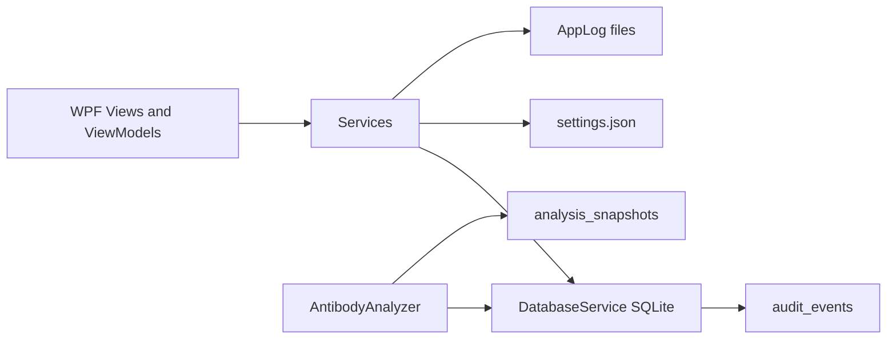

# System and software architecture

## Layers

- **Views / ViewModels:** WPF tabs (Worklist through Rules) and dialogs.
- **Services:** `AntibodyAnalyzer`, `ReportService`, `SettingsService`, `SoftwareIdentity`, `AppLog`, seeders, vendor import.
- **Data:** `DatabaseService` — schema, migrations, audit, snapshots, lock checks.
- **Models:** specimens, panels, reactions, analysis DTOs, `RecordLockedException`.

## Safety-related modules

- Identification engine: [AntibodyAnalyzer.cs](../../AntibodyPanels/Services/AntibodyAnalyzer.cs)
- Confirmation / lock: [DatabaseService.cs](../../AntibodyPanels/Data/DatabaseService.cs), [AnalysisViewModel.cs](../../AntibodyPanels/ViewModels/AnalysisViewModel.cs)
- Labeling: [SoftwareIdentity.cs](../../AntibodyPanels/Services/SoftwareIdentity.cs), [ReportService.cs](../../AntibodyPanels/Services/ReportService.cs)

## Data stores

SQLite file with foreign keys enabled. Audit table is append-only (no delete API). Analysis snapshots cascade-delete with the specimen.

## External interfaces

Optional vendor HTTPS clients under `AntibodyPanels/Services/Vendors`.
